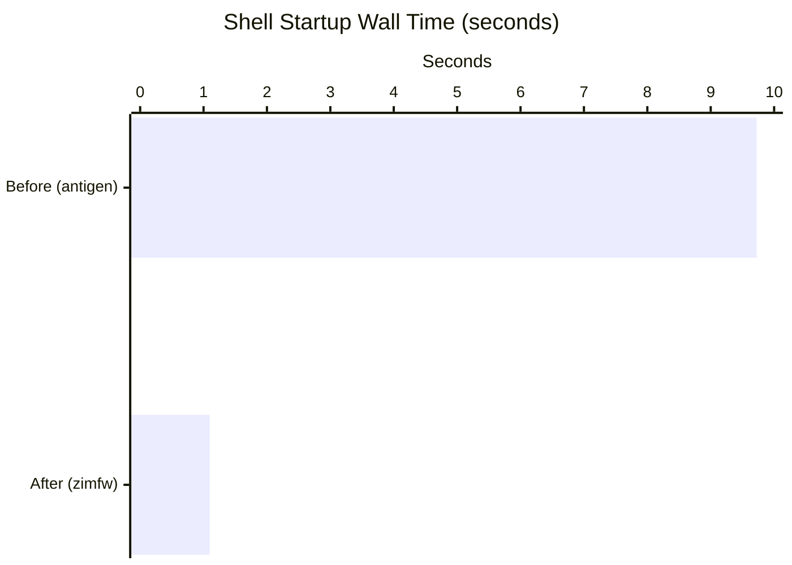
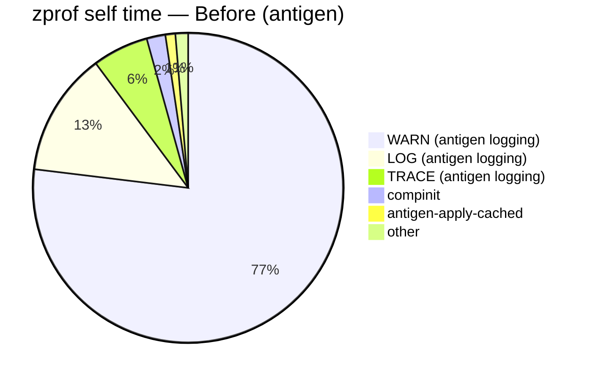
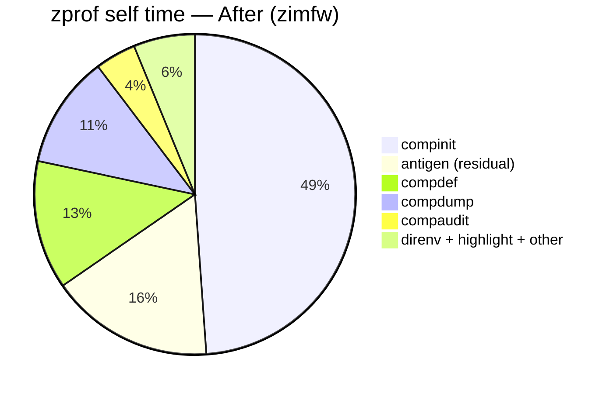
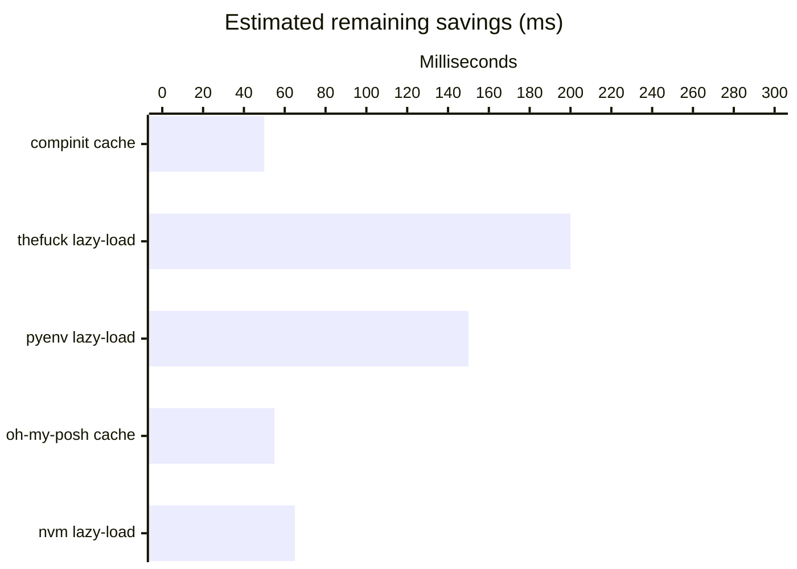

# Shell Startup Improvement — zimfw Migration

**Status:** Completed

**Date:** 2026-06-13  
**Change:** Replaced antigen with zimfw as the zsh plugin manager via `CLI_CONFIG_MODULES=zimfw`

---

## Wall Time

| | Before | After | Improvement |
|---|---|---|---|
| Wall time | 9.727s | 1.097s | **~9× faster** |
| User time | 0.41s | 0.36s | |
| System time | 0.56s | 0.43s | |

---

## Where Time Was Spent

### Before — antigen (9.7s total tracked)

Antigen's internal WARN/LOG/TRACE logging dominated. Every shell start triggered runtime plugin resolution.

### After — zimfw (1.1s total tracked)

Antigen logging noise is gone. `compinit` is now the dominant cost — previously invisible under antigen overhead.

---

## Why zimfw Is Faster

Antigen resolves plugins at runtime on every shell start — cloning, caching, and applying 6 plugins through a hook-based pipeline. Its internal WARN/LOG/TRACE calls alone accounted for **93%** of all tracked function time.

zimfw generates a static `init.zsh` at install time (`cli-config install -t zimfw`). Shell startup just `source`s that file — no git operations, no runtime resolution, no logging overhead.

---

## Remaining Opportunities

| Fix | Est. saving | Status |
|---|---|---|
| Cache `compinit` (skip rebuild if < 24h old) | 20–50ms | Pending |
| Lazy-load `thefuck` | 100–300ms | Pending |
| Lazy-load `pyenv init` | 100–200ms | Pending |
| Cache `oh-my-posh init` output | 30–80ms | Pending |
| Re-enable `nvm` lazy-load | 30–100ms | Pending |
| Native `CLI_CONFIG_ROOT` detection | 2–10ms | Pending |
| Remove `find/rm .zwc` from default `.zshrc` | 5–20ms | Pending |

See `plans-startup-improvement.md` for implementation details on each.
